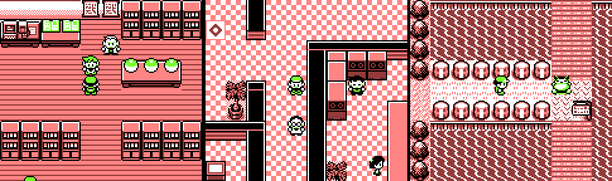

# pokered.ts

**pokered.ts** is a (work in progress) implementation of [Pokemon Red](https://en.wikipedia.org/wiki/Pok%C3%A9mon_Red,_Blue,_and_Yellow) written entirely in TypeScript.

The game is written with standard web technologies such as HTML Canvas and other native browser technologies
and satisfies [Atwood's Law](https://en.wiktionary.org/wiki/Atwood%27s_Law).

The original game's logic is studied by inspecting assembly code thanks to the [pret pokered disassembly](https://github.com/pret/pokered). No game assets are included in this repository, they are pulled from pret's `pokered` as a submodule during compile time.

Note: This project is \*NOT\* emulation. There is no emulation of the GameBoy's hardware, nor is the original game's code present or emulated in any fashion. The original game is written in Zilog Z80
assembly.

### [Play It Here in your Web Browser!](https://mattbruv.github.io/pokered.ts/)

## Why?

Pokemon Red is one of the [best selling video games](https://en.wikipedia.org/wiki/List_of_best-selling_video_games) of all time.
This singular game was the first introduction to the Pokemon universe, which went on to become the [highest grossing media franchise](https://en.wikipedia.org/wiki/List_of_highest-grossing_media_franchises) of all time.

There are various reasons why I am rewriting this game:

- Understand how GameFreak implemented the first ever Pokemon game.
- Publishing it on the web allows anyone with a web browser to enjoy one of the greatest games of all time.
- TypeScript allows for easy modification and customization of the game.
- A fun, technical challenge.
- Nostalgia, as this was the first ever video-game I played as a kid.

## Goals

1. Pokemon Red written in a high-level programming language (TypeScript)
2. A gameplay experience that is faithful to the original.
3. Easy to play. Click a link and enjoy. (no emulators or external programs needed)
4. Allow optional debug capabilities which enable the player to experiment with the game in ways which are much more user-friendly than GameShark code/memory address manipulation in emulators.

## Non-Goals

1. Glitch parity with the GameBoy version.
   - This version won't have most glitches found on the GameBoy version as the game's code is completely different and not emulated.
2. Pixel Perfect accuracy.
   - Some visuals, animations, or gameplay mechanics might not be pixel perfect or 100% accurate (though I do try to generally be as close as possible within reason)
3. Compatible save files with the GameBoy version. (though this is a cool idea and I might do it if it turns out to be possible and straightforward)

## Cool Ideas

When remaking this game on a modern platform, there are a lot of opportunities to create a fun experience which cannot be replicated by the GameBoy version. Here are a few ideas which I'm noting which may or may not be implemented:

- Trading/Battling via WebRTC
  - Connecting to other players via the PokeCenter could be as simple as just opening a peer to peer connection. This would enable battling your friends and trading Pokemon between web browsers, just as if it were 1996 and you were connected via Link-cable!
- Optionally allow keyboard use in cases where the user enters text in-game.

## Development

As this is an ambitious project, I welcome any and all contributions.

To set up a local version of this project, you will need Python and node.js installed,
and then it is as simple as cloning this repository + git submodules, and following the few install/build steps as they are laid out in the the job [in this workflow file](./.github/workflows/deploy.yml).

A few Python scripts are used to prepare graphics data and parse map files, and are only needed to be run once.

The game logic is all encapsulated in and exposed as a simple TypeScript library in [pokered.ts](./pokered.ts/).
There is a [demo](./demo/) folder which contains a simple UI utilizing the `pokered.ts` library which renders the game/debug menu/etc in a friendly way.
The demo site is what is hosted on GitHub pages.

Use `npm run watch` in `pokered.ts` to build the game and watch for changes.
Use `npm run dev` in parallel with `demo` to play the game in your browser.

## Resources

### General:

- [A History of Pokemon Red Development](https://www.youtube.com/watch?v=DaUHU2I-haA)
- [Game Boy Architecture](https://www.copetti.org/writings/consoles/game-boy/)
- [Pokemon Red Disassembly](https://github.com/pret/pokered)
- [Pokemon Red/Blue Map Visualization](https://blog.vjeux.com/2023/project/pokemon-red-blue-map.html)
- [Parsing Pokémon Red and Blue Maps](https://www.peterhajas.com/blog/pokemon_rb_map_parsing/)

### Implementation:

- [Color Palette Behavior](<https://bulbapedia.bulbagarden.net/wiki/Color_palette_(Generations_I%E2%80%93II)>)
- [Battle Animations by Index number](https://bulbapedia.bulbagarden.net/wiki/List_of_battle_animations_by_index_number_in_Generation_I)

### Other Attempts:

Here are a few repositories where others have attempted to recreate the game, all of which are mostly just prototypes at various stages of completion.
From what I can tell, `pokered.ts` is the most faithful implementation so far.

- [chase-manning/pokemon-js](https://github.com/chase-manning/pokemon-js) (most progress out of the ones I found, but buggy and far from finished)
- [KentGrigo/Pokemon](https://github.com/KentGrigo/Pokemon) (visually different, crude)
- [jamescastells/pokemonHTML](https://github.com/jamescastells/pokemonHTML) (only one route)
- [smith-chris/poke](https://github.com/smith-chris/poke) (unsure of progress because demo 404s)
